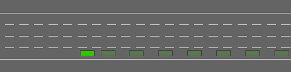
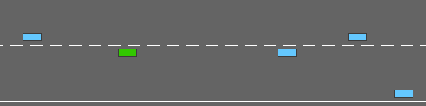
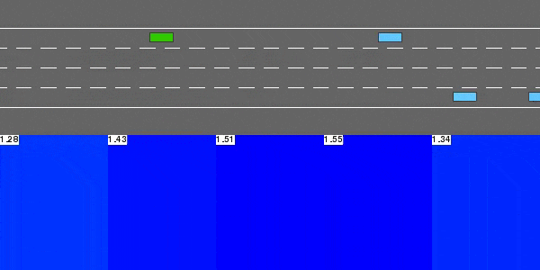
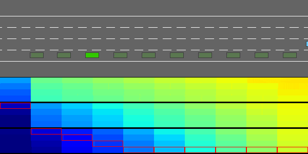
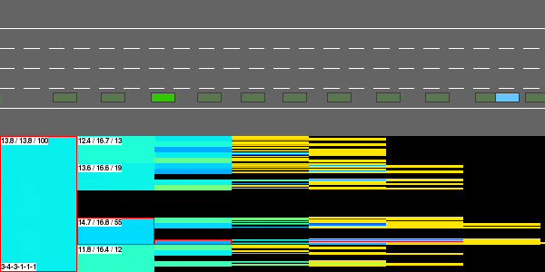

# highway-env

A collection of environments for *highway driving* and tactical decision-making tasks

<p align="center">
    <br/>
    <em>An episode of one of the environments available in higwhay-env.</em>
</p>

[](https://travis-ci.org/eleurent/highway-env)
[](https://eleurent.github.io/highway-env/)

## Installation

`pip install --user git+https://github.com/eleurent/highway-env`

## Usage

```python
import higwhay_env

env = gym.make("highway-v0")

done = False
while not done:
    action = ... # Your agent code here
    obs, reward, done, _ = env.step(action)
    env.render()
```

## The environments

### Highway

```python
env = gym.make("highway-v0")
```

In this task, the ego-vehicle is driving on a multilane highway populated with other vehicles.
The agent's objective is to reach a high velocity while avoiding collisions with neighbouring vehicles. Driving on the right side of the road is also rewarded.

<p align="center">
    <br/>
    <em>The higwhay-v0 environment.</em>
</p>


### Merge

```python
env = gym.make("highway-merge-v0")
```

On this task, the ego-vehicle starts on a main highway but soon approaches a road junction with incoming vehicles on the access ramp. The agent's objective is now to maintain a high velocity while making room for the vehicles so that they can safely merge in the traffic.

<p align="center">
    <br/>
    <em>The highway-merge-v0 environment.</em>
</p>


## The framework

New highway driving environments can easily be made from a set of building blocks.

### Roads

A `Road` is composed of several `Lanes` and a list of `Vehicles`. The Lanes are described by their center line curve and local coordinate system.

### Vehicle physics

The vehicles dynamics are represented in the `Vehicle` class by a bicycle model.

```python
dx = v*cos(psi)
dy = v*sin(psi)
dv = a
dpsi = v/l*tan(beta)
```
Where *(x, y)* is the vehicle position, *v* its forward velocity and *psi* its heading.
*a* is the acceleration command and *beta* is the slip angle at the center of gravity, used as a steering command.

### Control

The `ControlledVehicle` class implements a low-level controller on top of a `Vehicle`, allowing to track a given target velocity and follow a target lane.

### Behaviours

The vehicles populating the highway follow simple and realistic behaviours that dictate how they accelerate and steer on the road.

In the `IDMVehicle` class,
* Longitudinal Model: the acceleration of the vehicle is given by the Intelligent Driver Model (IDM) from [(Treiber et al, 2000)](https://arxiv.org/abs/cond-mat/0002177).
* Lateral Model: the discrete lane change decisions are given by the MOBIL model from [(Kesting et al, 2007)](https://www.researchgate.net/publication/239439179_General_Lane-Changing_Model_MOBIL_for_Car-Following_Models).

In the `LinearVehicle` class, the longitudinal behavior is defined as a linear weighting of several features, such as the distance and velocity difference to the leading vehicle.

## The agents

Agents solving the `highway-env` environments are available in the [RL-Agents](https://github.com/eleurent/rl-agents) repository.

`pip install --user git+https://github.com/eleurent/rl-agents`

### Deep Q-Network


<p align="center">
    <br/>
    <em>The DQN agent solving highway-v0.</em>
</p>

This model-free reinforcement learning agent performs Q-learning with function approximation, using a neural network to represent the state-action value function Q.


### Value Iteration

<p align="center">
    <br/>
    <em>The TTC Value Iteration agent solving highway-v0.</em>
</p>

This agent uses a simple representation of the nearby traffic in terms of predicted Time-To-Collision (TTC) on each lane of the road, and performs a Value Iteration to compute the corresponding optimal value function.

The transition model of the TTC-state is simplistic and assumes that each vehicle will keep driving at a constant velocity without changing lanes. This model bias can be a source of mistakes.

### Monte-Carlo Tree Search

This agent leverages a transition and reward models to perform a stochastic tree search [(Coulom, 2006)](https://hal.inria.fr/inria-00116992/document) of the optimal trajectory. No particular assumption is required on the state representation or transition model.

<p align="center">
    <br/>
    <em>The MCTS agent solving highway-v0.</em>
</p>